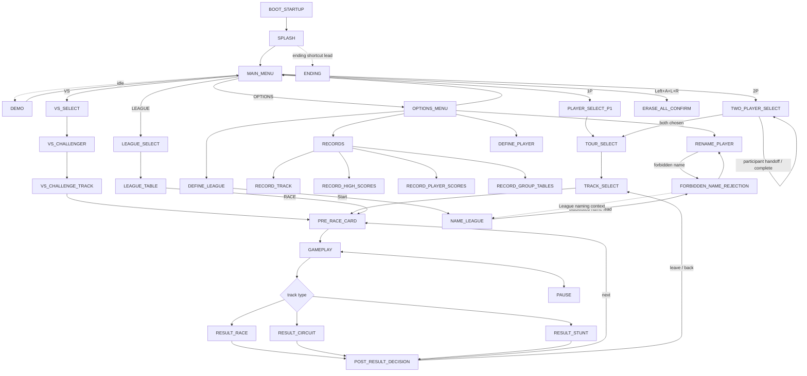

# UI / Screen State Map

Status: executable research model in active expansion, 2026-09-29.

This document is the human-readable companion to `analysis/ui-state-map.yml`. The YAML is the machine-readable graph; this page explains how to use it and what is actually known.

The point is not merely to collect screenshots. The project needs a navigable model of the game's frontend and result flow so an agent can answer questions such as:

- What screen am I on?
- Which inputs are legal here?
- What state should a given input reach?
- Which screens are informational only versus selectable menus?
- Which paths differ for 1P, 2P, VS, League, and the three track types?
- Which observations are direct, which come from the manual, and which are still inference?

This is useful immediately for deterministic controller fixtures and later for reverse engineering, frontend reconstruction, automated menu navigation, HD Presentation work, and matching routines/data to player-visible states.

## Evidence discipline

Every state and transition in the YAML carries an evidence/confidence marker. The current evidence classes are:

- `observed_screenshot`: visible in a public screenshot or locally captured frame.
- `primary_manual`: stated by the original USA instruction manual or its transcription.
- `reproduced_runtime`: directly reproduced in the canonical ROM/runtime.
- `inferred`: a structural inference that must be verified before becoming a fidelity claim.
- `unknown`: a deliberate placeholder.

A screenshot can prove layout, labels, selection state, visible affordances, and sometimes context. It does **not** by itself prove what a button does. Conversely, the manual can prove intended navigation but may omit timing, hidden conditions, edge cases, or implementation quirks.

The eventual target is to convert important edges to `reproduced_runtime` using cheap deterministic controller scripts, not to leave the frontend as folklore.

## Completion tiers and stopping rule

The atlas is a project resource, not a collection challenge. Missing evidence does not have equal priority.

Classify unresolved states/edges into three tiers before spending effort:

- **Tier 1 — critical fidelity.** Required for ordinary play, progression, implementation, deterministic validation, 2P/VS behavior, split-screen/HUD presentation, emulator-compatibility seams, or an active product decision. These should be reproduced or understood well enough to serve as an implementation/validation oracle.
- **Tier 2 — cheap completeness.** Evidence available from the original manual, public screenshots, the recovered 2014 bot, existing local dumps/artifacts, or a trivial bounded controller probe. Harvest it because it is cheap, but do not let it displace Tier 1 work.
- **Tier 3 — archaeological tail.** Quirks with little or no implementation consequence, including exact forbidden-name rejection details, exhaustive blacklist contents, destructive-secret chord minutiae, exact attract timing, every transient score/tally substate, punctuation-editor wrapping, or similarly obscure administrative behavior. Keep any evidence already found; do not pursue missing details unless another task makes them relevant.

A gap report is therefore **not** a completion checklist. A Tier 3 gap may remain open indefinitely without making the atlas incomplete for project purposes. If a Tier 3 question becomes relevant to implementation, validation, compatibility, or a deliberate authentic-mode promise, promote it explicitly rather than silently spending research time on it.

Use this order when the atlas informs another task:

1. consume already-promoted local evidence;
2. check indexed manual/public/historical evidence;
3. run the smallest deterministic observation that can answer the question;
4. trace/disassemble only if the answer materially matters and remains ambiguous.

## Core menu convention

The USA manual explicitly describes a global menu convention:

- D-pad moves the arrow.
- B or A moves forward to the next menu / chooses the highlighted item.
- Y or X moves back to the previous menu.

The same manual's quick-start section says that from the initial 1P selection, A, B, or Start can advance. Treat Start as a confirmed special case for that route until broader behavior is reproduced.

The manual also makes a useful terminology distinction: a **Menu** contains selectable items; a **Screen** is informational. That distinction is preserved in the state graph.

## Modern frontend contract

This map describes the original frontend faithfully. It is also the evidence base for deciding which original states survive unchanged, which become optional authentic/reference states, and which can be collapsed or replaced in the modern product layer.

Do **not** interpret "modernize the frontend" as permission to discard original presentation. The project policy is:

- preserve existing audiovisual indicators, result rituals, icons, animations, menu art, characteristic motion, typography, color language and sounds;
- when clarity is needed, add information around an original indicator rather than silently replacing it;
- preserve the recognizable overall menu look and interaction character even when choices are added, removed, regrouped or flattened;
- separate fidelity questions ("what did the original do?") from product questions ("should modern mode still require it?");
- keep enough original behavior reachable in authentic/reference mode to validate the source game.

The modern naming policy is deliberately simple: player-created racer names are not subject to the original forbidden-name/Easter-egg rejection system. That system may remain documented and reproducible only in authentic/reference archaeology where useful; it is not a shipping modern-mode feature.

The strongest current candidates for **modern product-layer simplification** are administrative rather than mechanical:

- named/color-coded racers should no longer double as save slots;
- modern players should be able to create/name/customize a racer independently of profile/save storage;
- all original named/color combinations remain faithful presets and may also be promoted into AI/ghost/tournament cast roles;
- Bronsen, Silverton and Goldwyn remain named legacy opponents even if medal-tier progression changes;
- League setup/player-management should be evaluated for a much simpler modern tournament path while preserving the original League flow as reference behavior;
- Bronze/Silver/Gold repeated-tour requirements should be evaluated for performance-based medal awarding or selectable challenge tiers rather than mandatory replay;
- unfinished-tour/session persistence should be modernized unless testing shows a deliberate gameplay purpose;
- destructive controller chords should become explicit UI actions with confirmation in modern mode;
- Records/score silos may be unified behind a modern records surface while retaining original table/indicator presentations as views;
- basic control/status information should not depend on an instruction manual, while secrets and advanced discoveries can remain intentionally opaque;
- preserve the original forbidden-name detection as a modern Easter egg: entering one of those names should show a special **"COOL NAME!"** acknowledgement and then accept the name rather than reject it.

The state-level classification is now encoded in `analysis/ui-transition-contract.json` under `completion_tiers`. `tools/validate_ui_state_model.py` requires every conceptual state to appear in exactly one tier, and `tools/report_ui_coverage.py` reports Tier 1 gaps separately from the full archaeological queue. Edge evidence status remains independent: a Tier 1 edge may still be `documented`, `historical`, or `hypothesis` until runtime evidence promotes it.


## Current high-level graph



This is intentionally a skeleton. It is more valuable to have an incomplete graph with explicit unknowns than a polished diagram that silently invents behavior.

## Existing deterministic evidence

The repository already had more frontend instrumentation than the initial screen-map idea assumed.

`tests/input/reach-first-race.script` is a controller-only route through the 1P spine. It waits for stable WRAM states, pauses 60 guest frames after newly reached menus, and emits `dump` checkpoints before every confirm. Those dumps are not just memory snapshots: the pinned SNESRecomp `dump <tag>` path writes a `<tag>.fb.bmp` framebuffer plus WRAM, VRAM, CGRAM, OAM, SRAM, PPU/register metadata, write logs, and frame metadata.

That gives the following locally reproduced state anchors:

| UI state | Local signature | Existing dump tag |
|---|---|---|
| MAIN_MENU | `7E:009F = D7` | `main-menu-ready` |
| PLAYER_SELECT_P1 | `7E:009F = 3C` | `rider-select-ready` |
| TOUR_SELECT | `7E:009F = 6D` | `tours-ready` |
| TRACK_SELECT | `7E:009F = F6` | `tracks-ready` |
| PRE_RACE_CARD / Now Playing | `7E:009F = 16` | `now-playing-ready` |
| GAMEPLAY | `7E:0313 = 01` | `race-entered` |
| TWO_PLAYER_SELECT | `7E:009F = 3D` | `ui-two-player-entry` |
| VS_SELECT | `7E:009F = 3E`; raw SRAM owner `0x0743 = 04` for P1 and `02` for P2 | harvested VS frames; reset-free `ui-vs-handoff` owns future captures |
| OPTIONS_MENU | `7E:009F = 57` | `ui-options-entry` |
| RECORDS | `7E:009F = 5D` | `ui-records-entry` |
| RECORD_TRACK | entry `7E:009F = CC` | `ui-record-track-entry` |
| PAUSE | `7E:009F = 00`, `7E:0313 = 01` while overlay visible | `ui-pause-after-start` |
| RESULT_RACE | `7E:009F = 99` | `race-results` |

So the basic screenshot atlas does not need a new rendering subsystem. The harvested native artifact is summarized durably in `analysis/generated/ui-atlas-native-harvest-2026-09-29.md`, including framebuffer hashes and negative results so expired Actions artifacts do not erase the reasoning. It already falls out of a route the project trusts.

The repository includes `tests/input/ui-options-route.script`, a narrow reconnaissance fixture that:

1. starts from verified `MAIN_MENU`;
2. moves the arrow through 1P, 2P, VS, LEAGUE, and OPTIONS one item at a time;
3. requires `7E:009B` to advance from 0 through 4, guarding against swallowed inputs;
4. captures a framebuffer/state dump at every selection;
5. enters Options without pre-assuming its menu ID;
6. captures the observed Options state;
7. presses X per the manual's back-navigation convention;
8. requires return to `7E:009F = D7`.

The native smoke workflow now runs that fixture and uploads its BMP/state dumps alongside the existing race-route evidence. It prints the newly observed Options menu ID from WRAM when the route succeeds.

## Executable transition contract and coverage

The conceptual YAML remains the human-facing semantic authority, but Phase 2 adds a narrower machine-execution layer:

- `analysis/ui-transition-contract.json` records conservative state-to-state edges with explicit evidence status.
- `tools/query_ui_route.py` finds the shortest known route between conceptual states while allowing callers to cap the weakest evidence they are willing to trust.
- `tools/validate_ui_state_model.py` checks that transition endpoints, capture states, menu-index states, fixture references, and capture tags remain mutually consistent.
- `tools/report_ui_coverage.py` summarizes which states have menu IDs, capture contracts, and executable edges.
- `analysis/generated/ui-state-coverage.md` is the compact generated gap report. Its Tier 1 section is the default closure queue for atlas work; the all-gaps section remains useful for opportunistic evidence harvesting and archaeology.

Examples:

```bash
python3 tools/query_ui_route.py --from MAIN_MENU --to GAMEPLAY --max-status verified
python3 tools/query_ui_route.py --from MAIN_MENU --to RECORDS --max-status documented
python3 tools/query_ui_route.py --from SPLASH --to ENDING --max-status hypothesis
python3 tools/validate_ui_state_model.py
python3 tools/report_ui_coverage.py --out analysis/generated/ui-state-coverage.md
```

Evidence ceilings are cumulative:

```text
verified < documented < historical < hypothesis
```

A route requested with `--max-status documented` may use verified or manual-documented edges, but it will refuse a path that depends on a historical bot label or an untested hypothesis.

The first generated baseline exposed several bookkeeping gaps that were already known semantically. Later evidence has corrected some of those initial guesses rather than merely filling them in. In particular, the verified ordinary 1P Race route is `RESULT_RACE -> TRACK_SELECT` on A/B, not `RESULT_RACE -> POST_RESULT_DECISION`; the following X returns `TRACK_SELECT -> TOUR_SELECT`.

The same pass added capture contracts for Pause and Race Results and a controller-only Options fan-out covering Records, Define Player, Rename Player, and Define League. A separate safe probe enters the manual-documented erase-all confirmation, captures it, and cancels without ever confirming destructive state deletion. The completed native artifact also promoted the Options/Records/Track Records anchors and exposed reset-related false negatives in several multi-branch probes.

The current generated baseline has **35 conceptual states, 61 executable transitions, 106 capture contracts, 29 menu-index entries, and 31 states with at least one capture contract**. Eleven menu-index entries are locally verified and 24 states have indexed public visual leads. The Tier 1 queue is down to **13 gap observations across 23 critical states**. Most of that remaining weight is concentrated in deeper VS setup, Circuit/Stunt result promotion, two unresolved Records exits, and Ending verification rather than broad frontend darkness. The shared P1/P2 transport is already complete; its remaining atlas dependency is behavioral multiplayer verification.

## Records and naming substate expansion

The original `RECORDS` node was too coarse for an atlas. The manual explicitly describes four visibly distinct score screens:

- `RECORD_TRACK`: all-time per-track Gold/Silver/Bronze records with player-color star markers;
- `RECORD_HIGH_SCORES`: category highs such as time, wins, and points;
- `RECORD_PLAYER_SCORES`: individual player statistics; Up/Down cycles players;
- `RECORD_GROUP_TABLES`: League performance comparison; Up/Down cycles Leagues.

The exact entry order and next/previous behavior are intentionally still unresolved. `ui-records-explore.script` enters Records from a clean reset and independently probes Down, Up, Left, Right, A, and B, capturing before/after frames and state for classification instead of guessing.

The League editor is also split more faithfully:

```text
DEFINE_LEAGUE
   -- A/B, X/Y --> mutate membership
   -- Start --> NAME_LEAGUE
```

The manual confirms that `NAME_LEAGUE` uses an on-screen alphabet and supports names up to 19 characters. A historical secondary source says the same blacklist used for racer names can reject team names too, so `FORBIDDEN_NAME_REJECTION` is now modeled as a context-sensitive rejection screen rather than a child of `RENAME_PLAYER` only. That team-name edge remains a hypothesis until reproduced locally.

## Fast menu-ID lookup

`analysis/ui-menu-index.json` is the compact reverse index for the menu byte at `7E:009F`. It deliberately distinguishes locally verified entries from historical-bot leads.

Agents can query it without loading this whole document:

```bash
python3 tools/query_ui_state.py --menu-id 0x99
python3 tools/query_ui_state.py --menu-id 153
python3 tools/query_ui_state.py --state MAIN_MENU
python3 tools/query_ui_state.py --all
```

This is intended for exactly the reverse-engineering moment where a trace or WRAM dump exposes a menu byte and the agent needs a cheap semantic orientation before deciding what to inspect next.

## Visual contact sheet

`tools/build_ui_contact_sheet.py` turns the machine atlas into a single self-contained `ui-atlas.html` artifact. Each card embeds the canonical framebuffer BMP and labels it with:

- conceptual state ID and variant;
- capture tag and source fixture;
- guest frame where available;
- observed menu byte, selected option, row/column, and race state;
- capture status and mismatches.

`--include-missing` renders uncaptured states/tags as placeholders instead of silently omitting them. This makes the HTML useful both as a screenshot atlas and as a visual research queue.

The native smoke artifact therefore has three complementary atlas surfaces:

```text
ui-atlas.json                machine-readable capture/state facts
ui-atlas.md                  compact text table
ui-atlas.html                embedded visual contact sheet
ui-frame-comparisons.*       before/after pixel-delta summaries
```

## Framebuffer transition deltas

`analysis/ui-frame-comparisons.json` declares useful before/after framebuffer pairs across pause, erase confirmation, Records exploration, League table entry, and result-screen advancement.

`tools/compare_ui_frames.py` reads the generated BMPs and reports:

- changed-pixel count and fraction;
- the bounding box containing all changed pixels;
- mean absolute RGB-channel delta over changed pixels;
- dimension mismatches or missing captures without making optional probes fatal.

This is a triage aid, not an automatic semantic classifier. A tiny localized bounding box is a strong hint that only a cursor/indicator moved; a broad delta suggests a screen or major presentation transition. Animation can still confound either case, so visual/runtime evidence remains authoritative.

The native UI evidence artifact now contains both `ui-atlas.*` and `ui-frame-comparisons.*`.

## Headless atlas builder

`analysis/ui-capture-manifest.json` is the contract between deterministic UI fixtures and captured evidence. It declares which `dump <tag>` outputs correspond to which conceptual states, which WRAM fields are expected, and which values are intentionally being discovered.

`tools/build_ui_atlas.py` consumes one or more SNESRecomp dump directories and produces:

- a JSON report suitable for later tooling;
- a compact Markdown table for humans/agents;
- framebuffer SHA-256 fingerprints and dimensions;
- the dump frame number where available;
- observed `currentMenu`, selection, row/column, and in-race state;
- expected-vs-observed mismatches;
- explicit newly discovered values such as an unknown menu ID.

The native smoke now feeds its existing 1P route, the Options route, and the top-level branch probe into this builder. `--strict` makes known state anchors regression assertions while still allowing intentionally unknown fields to be reported as discoveries.

This gives the project a useful separation:

```text
conceptual graph        analysis/ui-state-map.yml
capture contract         analysis/ui-capture-manifest.json
controller journeys      tests/input/ui-*.script
raw evidence             <tag>.fb.bmp + WRAM/PPU/etc dumps
derived atlas            ui-atlas.json + ui-atlas.md
```

The conceptual graph should stay concise. The capture manifest owns reproducible visual/runtime anchors. Raw images remain generated evidence rather than bloating the repository.

### Current multiplayer automation boundary

The shared deterministic controller transport is now present on `main`. Its neutral stream is `start:duration:p1-mask[:p2-mask]`, with independent P1/P2 masks consumed by the native Lua adapter, patched `snesref`, and Mesen adapter.

The remaining boundary is behavioral verification and capture synchronization, not input syntax. `TWO_PLAYER_SELECT = 0x3D` and `VS_SELECT = 0x3E` are now locally reproduced. An accidental VS route also proves the visible P1→P2 selector handoff while `0x3E` remains stable; raw SRAM offset `0x0743` changes `04 -> 02` across that handoff. `docs/TWO-PLAYER-FIXTURE-PLAN.md` owns the remaining acceptance route: prove P2-only causality/confirmation, reconcile that raw discriminator with the historical bot's 5/3/1 comment, then attach stable checkpoints to `VS_CHALLENGER`, `VS_CHALLENGE_TRACK`, 2P progression, and split-screen gameplay.

## Top-level branch probes

The branch now includes `tests/input/ui-main-branches.script`, which starts each test from a clean reset and exercises:

```text
MAIN_MENU --2P--> first 2P screen --X--> MAIN_MENU
MAIN_MENU --VS--> first VS screen --X--> MAIN_MENU
MAIN_MENU --LEAGUE--> first League screen --X--> MAIN_MENU
```

The original multi-branch fixture uses scripted console resets between branches. The successful native artifact captured the first 2P branch, then the runtime crashed during reset before VS/League could execute. That is a harness/reset limitation, not evidence that the later game branches are absent.

`tests/input/ui-vs-handoff.script` now provides a reset-free, selectedOption-guarded VS route in its own process. It targets the locally established `0x3E` P1/P2 handoff and captures the SRAM ownership discriminator. The recovered bot's later VS phases at `0x3F` and `0x5A` remain queued behind real P2 confirmation. League remains open: the earlier nominal League probe actually landed in VS because rapid menu inputs were swallowed, and its labels have explicitly not been promoted as League evidence.

## Screenshot-backed states already found online

Public screenshot galleries already give enough to anchor several states without spending compute on discovery:

### MAIN_MENU

A clear screenshot shows:

```text
1P
2P
VS
LEAGUE
OPTIONS
```

with the animated arrow on 1P. This matches the manual exactly.

Useful public references:
- MobyGames Uniracers screenshot gallery: https://www.mobygames.com/game/8085/uniracers/screenshots/
- GameStar gallery: https://www.gamestar.de/galerien/uniracers_snes,48628.html
- Freebie Games screenshot used only as a visual lead: https://freebie.games/games/uniracers/

### PLAYER_SELECT

A public screenshot shows the "PICK YOUR ..." unicycle roster with named, color-coded unicycles and the selection arrow. This matches the manual's Player Select description.

Useful public references:
- MobyGames gallery above.
- GameStar gallery above.

### TOUR_SELECT

A public screenshot shows the animal-icon tour selector, including Crawler, Shuffler, Walker, and Hopper. The manual names the eight normal progression tours; external gameplay documentation and the project's 45-track corpus support Hunter as a hidden ninth tour.

Do not flatten this into "nine normal choices available from boot." Progression/unlock state matters.

### TRACK_SELECT

A public screenshot of the Hunter tour shows a five-item track list with distinct type icons and a medal/rank display. This is a strong visual anchor for the generic track-selection state.

Useful public reference:
- Demented Ferrets review screenshot: https://dementedferrets.com/2021/02/24/uniracers-review-bombastic-fun/

The screenshot itself should not be copied into project-owned art unless rights are established. For now the repo records the source and the state it helps identify.

### Exceptional and startup states

The wider public corpus and recovered bot labels add a few branches that are easy to miss if the model only follows the happy path:

- `SPLASH`: recovered bot value `0x84`; public galleries independently show an Intro Screen.
- `DEMO`: recovered bot value `0x00`; the exact Main Menu idle timeout and return behavior are still unknown.
- `ENDING`: recovered bot value `0x5B`; a secondary cheat reference describes a title/splash shortcut using Down+L+R+B, which is useful as a cheap local verification route.
- `FORBIDDEN_NAME_REJECTION`: public screenshot sets include the "No Sonic Allowed" rejection/Easter-egg screen. This belongs in the graph because name validation is already an identified technical seam elsewhere in the project.

These stay explicitly lower-confidence until a local controller/input route captures them.

## Manual-backed states that still need screenshots/runtime capture

The original manual provides enough structure to seed states that were not found in the first screenshot sweep:

- `PRE_RACE_CARD`: a brief screen states who is playing whom and on what track.
- `RESULT_CIRCUIT`: immediate circuit result with per-lap indicators.
- `RESULT_STUNT`: stunt tally/result.
- `LEAGUE_SELECT`: list of active leagues.
- `LEAGUE_TABLE`: league positions plus a RACE action.
- the remaining `RECORDS` screens: High Scores, Player Scores, and Group Tables. `RECORDS` itself and Track Records are now locally captured.
- `DEFINE_PLAYER`.
- `RENAME_PLAYER`.
- `DEFINE_LEAGUE`.
- `ERASE_ALL_CONFIRM`.

The first skeleton treated multiplayer rider selection as one generic second-player state. The recovered 2014 bot makes that simplification unsafe: it names distinct `TWO_PLAYER_SELECT = 0x3D`, `VS_SELECT = 0x3E`, `VS_CHALLENGER = 0x3F`, and `VS_CHALLENGE_TRACK = 0x5A` states. The conceptual graph now keeps those phases separate while marking the handoffs/transitions as inferred until local controller-only captures promote them.

## Important known special inputs

These should become deterministic fixtures because they are cheap and behaviorally distinctive:

| From | Input | Expected result | Current evidence |
|---|---|---|---|
| MAIN_MENU, 1P selected | A or B | PLAYER_SELECT_P1 | manual |
| MAIN_MENU, 1P selected | Start | PLAYER_SELECT_P1 | manual quick-start |
| Generic menu | D-pad | move arrow | manual |
| Generic menu | A or B | choose / advance | manual |
| Generic menu | Y or X | previous menu | manual |
| MAIN_MENU | hold Left + A + L + R | erase-all confirmation | manual |
| DEFINE_LEAGUE | SELECT + Y + A | guarded redefine/destructive action | manual |
| GAMEPLAY | Start | pause | locally reproduced; overlay keeps `currentMenu=00`, `inRace=01` on tested route |

The exact frame timing and chord semantics of destructive combinations remain runtime questions.

## Why screenshots and control intuition are worth using

The first pass should absolutely exploit obvious human-readable evidence before reaching for instrumentation.

For a screen with a single animated arrow, a list of choices, and the game's documented menu convention, an agent can usually form a very strong hypothesis:

1. D-pad changes selection.
2. A/B confirms.
3. X/Y backs out.
4. The highlighted item's label predicts the next screen family.

That is enough to build a candidate input script. The candidate should then be **verified cheaply**, ideally by checking a frame hash/screenshot, RAM signature, or known state transition after the input sequence.

This is preferable to tracing controller-read code just to discover that pressing Down moves a menu arrow.

Compute and disassembly become worthwhile when:
- a route does not behave as the visible/menu evidence predicts;
- timing matters;
- a screen is hidden or conditional;
- two visually identical screens behave differently;
- a destructive or progression-sensitive action needs certainty;
- the frontend logic itself becomes a reverse-engineering target.

## Screenshot atlas plan

The repo should grow a state-indexed visual atlas, but avoid turning third-party screenshots into untracked project assets.

For each state, record:

```text
state id
build / region
source
capture method
visible labels
current selection
known inputs
preceding state
following state
confidence
notes
```

Prefer locally captured canonical-ROM frames as soon as they are cheap to obtain. Public screenshots are excellent bootstrap evidence and gap finders.

A future local layout could be:

```text
analysis/ui/
  captures/
    usa/
      MAIN_MENU.png
      PLAYER_SELECT_P1.png
      TOUR_SELECT.png
      ...
  capture-manifest.yml
```

Do not commit large redundant frame sequences. One representative frame per stable state plus transition evidence is usually enough.

## Cheap next verification pass

A good deterministic frontend fixture can probably cover most of the basic 1P spine:

```text
boot
-> MAIN_MENU
-> choose 1P
-> PLAYER_SELECT_P1
-> choose first/default unicycle
-> TOUR_SELECT
-> choose first/default tour
-> TRACK_SELECT
-> choose first/default track
-> PRE_RACE_CARD
-> GAMEPLAY
```

At every stable stop, capture one screenshot/frame fingerprint and, if useful, a small state signature. Then add backward-navigation checks with X/Y.

A separate short fixture should cover OPTIONS and RECORDS. Another should exercise 2P/VS second-player selection. League, destructive confirmations, progression unlocks, and Hunter can remain isolated fixtures because they have more setup or risk.

## Startup / attract probes

Two optional controller-only fixtures now attack the startup fringe without weakening the core smoke:

- `ui-ending-shortcut.script` waits for recovered `SPLASH = 0x84`, captures it, then tries the secondary-source Down+L+R+B ending shortcut and looks for recovered `ENDING = 0x5B`.
- `ui-attract-route.script` waits for verified `MAIN_MENU = 0xD7`, enables turbo, then waits for a natural no-input departure and captures the destination instead of assuming it is `DEMO = 0x00`.

Both are optional atlas captures. Failure means "the cheap hypothesis did not reproduce yet," not "the native runtime is broken." Their logs and any partial dumps are still uploaded.

## Current unresolved questions

The machine-readable file tracks these as `UIQ-001` onward. The new Options fixture should cheaply close part of item 6 once its artifact is available. Highest-value ones are:

1. Exact boot/logo/intro sequence and skip behavior.
2. Whether A/B equivalence and X/Y-back are genuinely universal.
3. P2-only causality/confirmation, deeper VS back-stack, and the exact meaning/mapping of the raw SRAM ownership discriminator.
4. Pre-race card timing and skip input.
5. Circuit/Stunt/2P/VS/League post-result choices; ordinary 1P Race is now locally pinned.
6. Remaining Options substate behavior rather than the already captured hub.
7. Records score-screen order/navigation, especially the three uncaptured score families and Track Records internal `0xCC -> 0x5A` behavior.
8. Pause QUIT behavior; pause presentation and Start-resume are now locally captured.
9. Attract/demo timeout and return path.
10. Hunter unlock and Anti-Uni-specific frontend/result states.

These are mostly cheap observational questions. Agents should avoid escalating them into broad code archaeology unless observation fails to distinguish the behavior.

## Primary references

The repo already catalogues the USA manual scan and a manual transcription. The initial public-screen sweep additionally found the MobyGames and GameStar screenshot galleries plus a Hunter Track Select screenshot in the Demented Ferrets review.

Those sources are leads. Canonical behavior should migrate toward locally reproduced evidence as the relevant states become easy to reach.
