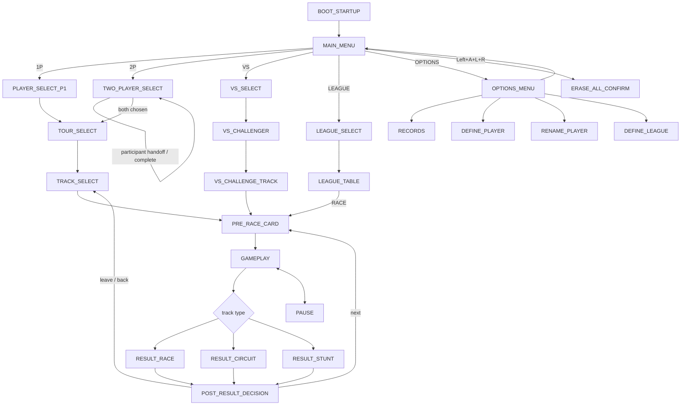

# UI / Screen State Map

Status: seed skeleton, 2026-09-29.

This document is the human-readable companion to `analysis/ui-state-map.yml`. The YAML is the machine-readable graph; this page explains how to use it and what is actually known.

The point is not merely to collect screenshots. The project needs a navigable model of the game's frontend and result flow so an agent can answer questions such as:

- What screen am I on?
- Which inputs are legal here?
- What state should a given input reach?
- Which screens are informational only versus selectable menus?
- Which paths differ for 1P, 2P, VS, League, and the three track types?
- Which observations are direct, which come from the manual, and which are still inference?

This is useful immediately for deterministic controller fixtures and later for reverse engineering, frontend reconstruction, automated menu navigation, HD Presentation work, and matching routines/data to player-visible states.

## Evidence discipline

Every state and transition in the YAML carries an evidence/confidence marker. The current evidence classes are:

- `observed_screenshot`: visible in a public screenshot or locally captured frame.
- `primary_manual`: stated by the original USA instruction manual or its transcription.
- `reproduced_runtime`: directly reproduced in the canonical ROM/runtime.
- `inferred`: a structural inference that must be verified before becoming a fidelity claim.
- `unknown`: a deliberate placeholder.

A screenshot can prove layout, labels, selection state, visible affordances, and sometimes context. It does **not** by itself prove what a button does. Conversely, the manual can prove intended navigation but may omit timing, hidden conditions, edge cases, or implementation quirks.

The eventual target is to convert important edges to `reproduced_runtime` using cheap deterministic controller scripts, not to leave the frontend as folklore.

## Core menu convention

The USA manual explicitly describes a global menu convention:

- D-pad moves the arrow.
- B or A moves forward to the next menu / chooses the highlighted item.
- Y or X moves back to the previous menu.

The same manual's quick-start section says that from the initial 1P selection, A, B, or Start can advance. Treat Start as a confirmed special case for that route until broader behavior is reproduced.

The manual also makes a useful terminology distinction: a **Menu** contains selectable items; a **Screen** is informational. That distinction is preserved in the state graph.

## Current high-level graph



This is intentionally a skeleton. It is more valuable to have an incomplete graph with explicit unknowns than a polished diagram that silently invents behavior.

## Existing deterministic evidence

The repository already had more frontend instrumentation than the initial screen-map idea assumed.

`tests/input/reach-first-race.script` is a controller-only route through the 1P spine. It waits for stable WRAM states, pauses 60 guest frames after newly reached menus, and emits `dump` checkpoints before every confirm. Those dumps are not just memory snapshots: the pinned SNESRecomp `dump <tag>` path writes a `<tag>.fb.bmp` framebuffer plus WRAM, VRAM, CGRAM, OAM, SRAM, PPU/register metadata, write logs, and frame metadata.

That gives the following locally reproduced state anchors:

| UI state | Local signature | Existing dump tag |
|---|---|---|
| MAIN_MENU | `7E:009F = D7` | `main-menu-ready` |
| PLAYER_SELECT_P1 | `7E:009F = 3C` | `rider-select-ready` |
| TOUR_SELECT | `7E:009F = 6D` | `tours-ready` |
| TRACK_SELECT | `7E:009F = F6` | `tracks-ready` |
| PRE_RACE_CARD / Now Playing | `7E:009F = 16` | `now-playing-ready` |
| GAMEPLAY | `7E:0313 = 01` | `race-entered` |

So the basic screenshot atlas does not need a new rendering subsystem. It already falls out of a route the project trusts.

This branch also adds `tests/input/ui-options-route.script`, a narrow reconnaissance fixture that:

1. starts from verified `MAIN_MENU`;
2. moves the arrow through 1P, 2P, VS, LEAGUE, and OPTIONS one item at a time;
3. requires `7E:009B` to advance from 0 through 4, guarding against swallowed inputs;
4. captures a framebuffer/state dump at every selection;
5. enters Options without pre-assuming its menu ID;
6. captures the observed Options state;
7. presses X per the manual's back-navigation convention;
8. requires return to `7E:009F = D7`.

The native smoke workflow now runs that fixture and uploads its BMP/state dumps alongside the existing race-route evidence. It prints the newly observed Options menu ID from WRAM when the route succeeds.

## Headless atlas builder

`analysis/ui-capture-manifest.json` is the contract between deterministic UI fixtures and captured evidence. It declares which `dump <tag>` outputs correspond to which conceptual states, which WRAM fields are expected, and which values are intentionally being discovered.

`tools/build_ui_atlas.py` consumes one or more SNESRecomp dump directories and produces:

- a JSON report suitable for later tooling;
- a compact Markdown table for humans/agents;
- framebuffer SHA-256 fingerprints and dimensions;
- the dump frame number where available;
- observed `currentMenu`, selection, row/column, and in-race state;
- expected-vs-observed mismatches;
- explicit newly discovered values such as an unknown menu ID.

The native smoke now feeds its existing 1P route, the Options route, and the top-level branch probe into this builder. `--strict` makes known state anchors regression assertions while still allowing intentionally unknown fields to be reported as discoveries.

This gives the project a useful separation:

```text
conceptual graph        analysis/ui-state-map.yml
capture contract         analysis/ui-capture-manifest.json
controller journeys      tests/input/ui-*.script
raw evidence             <tag>.fb.bmp + WRAM/PPU/etc dumps
derived atlas            ui-atlas.json + ui-atlas.md
```

The conceptual graph should stay concise. The capture manifest owns reproducible visual/runtime anchors. Raw images remain generated evidence rather than bloating the repository.

## Top-level branch probes

The branch now includes `tests/input/ui-main-branches.script`, which starts each test from a clean reset and exercises:

```text
MAIN_MENU --2P--> first 2P screen --X--> MAIN_MENU
MAIN_MENU --VS--> first VS screen --X--> MAIN_MENU
MAIN_MENU --LEAGUE--> first League screen --X--> MAIN_MENU
```

The destination menu IDs are not hard-coded. Each entry state is dumped and passed to the atlas as a discovery. The recovered 2014 bot predicts `0x3D` for `TWO_PLAYER_SELECT` and `0x3E` for `VS_SELECT`; the local capture decides whether those labels are promoted. It also predicts later VS phases at `0x3F` and `0x5A`, which remain queued for follow-on probing. League is deliberately left entirely open because the historical bot does not provide a useful named League menu anchor.

## Screenshot-backed states already found online

Public screenshot galleries already give enough to anchor several states without spending compute on discovery:

### MAIN_MENU

A clear screenshot shows:

```text
1P
2P
VS
LEAGUE
OPTIONS
```

with the animated arrow on 1P. This matches the manual exactly.

Useful public references:
- MobyGames Uniracers screenshot gallery: https://www.mobygames.com/game/8085/uniracers/screenshots/
- GameStar gallery: https://www.gamestar.de/galerien/uniracers_snes,48628.html
- Freebie Games screenshot used only as a visual lead: https://freebie.games/games/uniracers/

### PLAYER_SELECT

A public screenshot shows the "PICK YOUR ..." unicycle roster with named, color-coded unicycles and the selection arrow. This matches the manual's Player Select description.

Useful public references:
- MobyGames gallery above.
- GameStar gallery above.

### TOUR_SELECT

A public screenshot shows the animal-icon tour selector, including Crawler, Shuffler, Walker, and Hopper. The manual names the eight normal progression tours; external gameplay documentation and the project's 45-track corpus support Hunter as a hidden ninth tour.

Do not flatten this into "nine normal choices available from boot." Progression/unlock state matters.

### TRACK_SELECT

A public screenshot of the Hunter tour shows a five-item track list with distinct type icons and a medal/rank display. This is a strong visual anchor for the generic track-selection state.

Useful public reference:
- Demented Ferrets review screenshot: https://dementedferrets.com/2021/02/24/uniracers-review-bombastic-fun/

The screenshot itself should not be copied into project-owned art unless rights are established. For now the repo records the source and the state it helps identify.

## Manual-backed states that still need screenshots/runtime capture

The original manual provides enough structure to seed states that were not found in the first screenshot sweep:

- `PRE_RACE_CARD`: a brief screen states who is playing whom and on what track.
- `RESULT_RACE`: immediate race result.
- `RESULT_CIRCUIT`: immediate circuit result with per-lap indicators.
- `RESULT_STUNT`: stunt tally/result.
- `LEAGUE_SELECT`: list of active leagues.
- `LEAGUE_TABLE`: league positions plus a RACE action.
- `OPTIONS_MENU`.
- `RECORDS` family: Track Records, High Scores, Player Scores, Group Tables.
- `DEFINE_PLAYER`.
- `RENAME_PLAYER`.
- `DEFINE_LEAGUE`.
- `ERASE_ALL_CONFIRM`.

The first skeleton treated multiplayer rider selection as one generic second-player state. The recovered 2014 bot makes that simplification unsafe: it names distinct `TWO_PLAYER_SELECT = 0x3D`, `VS_SELECT = 0x3E`, `VS_CHALLENGER = 0x3F`, and `VS_CHALLENGE_TRACK = 0x5A` states. The conceptual graph now keeps those phases separate while marking the handoffs/transitions as inferred until local controller-only captures promote them.

## Important known special inputs

These should become deterministic fixtures because they are cheap and behaviorally distinctive:

| From | Input | Expected result | Current evidence |
|---|---|---|---|
| MAIN_MENU, 1P selected | A or B | PLAYER_SELECT_P1 | manual |
| MAIN_MENU, 1P selected | Start | PLAYER_SELECT_P1 | manual quick-start |
| Generic menu | D-pad | move arrow | manual |
| Generic menu | A or B | choose / advance | manual |
| Generic menu | Y or X | previous menu | manual |
| MAIN_MENU | hold Left + A + L + R | erase-all confirmation | manual |
| DEFINE_LEAGUE | SELECT + Y + A | guarded redefine/destructive action | manual |
| GAMEPLAY | Start | pause | manual/control documentation; capture still desirable |

The exact frame timing and chord semantics of destructive combinations remain runtime questions.

## Why screenshots and control intuition are worth using

The first pass should absolutely exploit obvious human-readable evidence before reaching for instrumentation.

For a screen with a single animated arrow, a list of choices, and the game's documented menu convention, an agent can usually form a very strong hypothesis:

1. D-pad changes selection.
2. A/B confirms.
3. X/Y backs out.
4. The highlighted item's label predicts the next screen family.

That is enough to build a candidate input script. The candidate should then be **verified cheaply**, ideally by checking a frame hash/screenshot, RAM signature, or known state transition after the input sequence.

This is preferable to tracing controller-read code just to discover that pressing Down moves a menu arrow.

Compute and disassembly become worthwhile when:
- a route does not behave as the visible/menu evidence predicts;
- timing matters;
- a screen is hidden or conditional;
- two visually identical screens behave differently;
- a destructive or progression-sensitive action needs certainty;
- the frontend logic itself becomes a reverse-engineering target.

## Screenshot atlas plan

The repo should grow a state-indexed visual atlas, but avoid turning third-party screenshots into untracked project assets.

For each state, record:

```text
state id
build / region
source
capture method
visible labels
current selection
known inputs
preceding state
following state
confidence
notes
```

Prefer locally captured canonical-ROM frames as soon as they are cheap to obtain. Public screenshots are excellent bootstrap evidence and gap finders.

A future local layout could be:

```text
analysis/ui/
  captures/
    usa/
      MAIN_MENU.png
      PLAYER_SELECT_P1.png
      TOUR_SELECT.png
      ...
  capture-manifest.yml
```

Do not commit large redundant frame sequences. One representative frame per stable state plus transition evidence is usually enough.

## Cheap next verification pass

A good deterministic frontend fixture can probably cover most of the basic 1P spine:

```text
boot
-> MAIN_MENU
-> choose 1P
-> PLAYER_SELECT_P1
-> choose first/default unicycle
-> TOUR_SELECT
-> choose first/default tour
-> TRACK_SELECT
-> choose first/default track
-> PRE_RACE_CARD
-> GAMEPLAY
```

At every stable stop, capture one screenshot/frame fingerprint and, if useful, a small state signature. Then add backward-navigation checks with X/Y.

A separate short fixture should cover OPTIONS and RECORDS. Another should exercise 2P/VS second-player selection. League, destructive confirmations, progression unlocks, and Hunter can remain isolated fixtures because they have more setup or risk.

## Current unresolved questions

The machine-readable file tracks these as `UIQ-001` onward. The new Options fixture should cheaply close part of item 6 once its artifact is available. Highest-value ones are:

1. Exact boot/logo/intro sequence and skip behavior.
2. Whether A/B equivalence and X/Y-back are genuinely universal.
3. Exact 2P/VS back-stack behavior.
4. Pre-race card timing and skip input.
5. Exact post-result choices for every mode.
6. Full Options layout.
7. Records screen order/navigation.
8. Pause presentation/actions.
9. Attract/demo timeout and return path.
10. Hunter unlock and Anti-Uni-specific frontend/result states.

These are mostly cheap observational questions. Agents should avoid escalating them into broad code archaeology unless observation fails to distinguish the behavior.

## Primary references

The repo already catalogues the USA manual scan and a manual transcription. The initial public-screen sweep additionally found the MobyGames and GameStar screenshot galleries plus a Hunter Track Select screenshot in the Demented Ferrets review.

Those sources are leads. Canonical behavior should migrate toward locally reproduced evidence as the relevant states become easy to reach.
